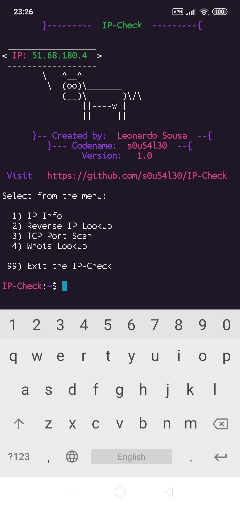
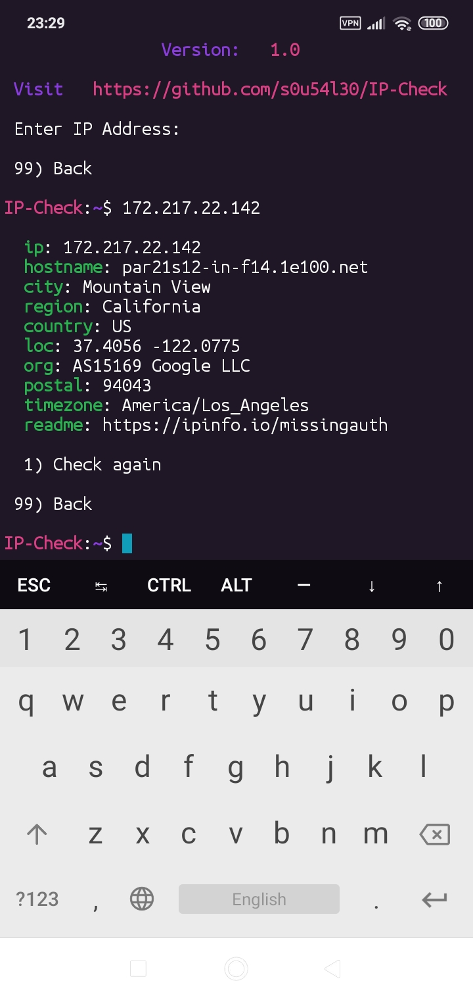
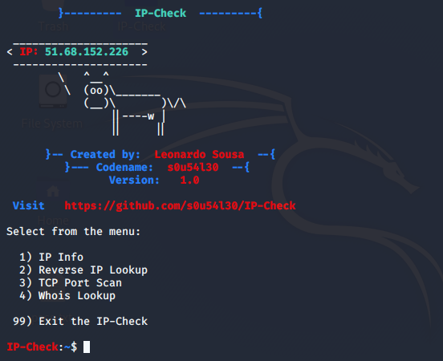

# :large_blue_diamond: IP-Check :large_blue_diamond:

Check IP Address information

### Operating System Requirements

* **Android** :iphone:
	* Temux App
* **Linux**  :penguin:
  * Python3

# :inbox_tray:  Installation :inbox_tray:

* **Temux App** :iphone:
  * `curl -sLf https://raw.githubusercontent.com/Visto-Preto/Ip-Check/master/install.sh | bash`

     

* **Linux** :penguin:
  * `curl -sLf https://raw.githubusercontent.com/Visto-Preto/Ip-Check/master/install.sh | bash`

